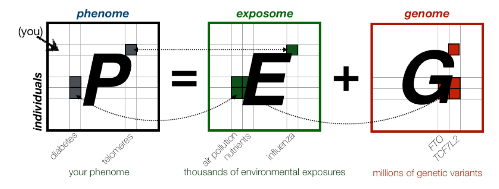

# BMI 704: Data Science for Medical Decision Making 
## Harvard Medical School 
### Spring 2020 
### Course Directors: Chirag J. Patel, Arjun K. Manrai
### MW 9:45am-11:15am, Countway 403

## Course Description

Have you ever Googled a health-related question and been dumbfounded by the hits? Gotten a lab test result and wondered if it applies to a person like you? Wondered what an "odds ratio" for a genetic variant you inherited is? Explanations of why we are who we are, and what diseases we might get, and why some of us are at risk, are often unsatisfactory. Interpreting how the phenome (e.g., disease) is connected to the exposome (e.g, our environment) and genome is challenging, especially in large and complex datasets. How these large data can be translated to decisions is even more elusive. It’s time to become an active consumer: in this course, we will develop skills in querying large real-world (e.g., <b>electronic medical records, biobanks</b>) and epidemiological data (e.g., <b>health surveys and longitudinal cohorts</b>) streams to make informed decisions through the lens of data science. This course will survey the current data and methodological approaches to conduct integrative high-throughput investigations merging genomic, exposomic, and phenomic datasets to discover new associations with disease and health. Students will be introduced to statistical decision theory and how modern data science and machine learning approaches can help improve rational medical decision making. Students will conduct a guided project analyzing data from the <b>US Centers for Disease Control and Prevention (CDC)</b> that will include contributing to an interactive textbook of data science methods. Guest lectures will demonstrate use-cases in the fields of real-world prediction in the clinic and public health.

### Goals:
1. Develop basic skills in biomedical data science, including R/RStudio and cloud-based infrastructure.
2. Interpret statistical estimates and biomedical findings in the published literature (and the lay press) from epidemiological studies.
3. Understand how decision theory and machine learning can enhance clinical care.
4. Develop your own prediction algorithms that integrate exposomic, genomic, and phenomic data.
5. Execute data-driven methods on current day computing clusters.

### Prerequisites
Familiarity with programming (e.g., R or Python or CS50 equivalent) in a Linux environment (i.e., use of the command line).  Students will be provided with access to a compute cluster (Google Cloud hosted).

# Course Calendar
| Week (Dates)  | Topics | Readings | Assignments (due 11:00pm) |
| :---: | ----------------------- | ------------- | ------------- |
|<b>Week 1 (1/27 and 1/29)</b>|<b>Data-driven Investigations into Fundamental Questions in Biomedicine</b>  <b>Lecture 1: 1/27</b><ol><li>Introduction to the course and course objectives</li><li>Overview of P = G + E (Phenotype = Genotype + Environment)</li><li>Basic concepts: prevalence and incidence</li><li>Introduction to traditional observational and agnostic ‘omic (e.g. GWAS) study designs</li></ol> <b>Lecture 2: 1/29</b><ol><li>Conducting reproducible research</li><li>Data science in R/Rstudio and cloud computing</li><li>Observational study desgined continued</li><li>Biases: confounding, reverse causality</li></ol>|Wickham and Grolemund 2016;  Vittinghoff et al. 2005: Chapters 1-5;  Paul R Burton et al. 2007;  Pearson and Manolio 2008;  Welch et al. 2019;  Cheng et al. 2019|Assignment 1 out 1/29: EWAS (due 2/12)|
|<b>Week 2 (2/3 and 2/5)</b>|<b>Dissecting Exposure-Phenotype Relationships</b>  <b>Lecture 3: 2/3</b><ol><li>Fundamentals: p-values, Bonferroni, effect sizes, and qq-plots</li><li>History of E associations (e.g. SES, vitamins, physical activity, air pollution)</li><li>Re-intro to study designs and regression tools</li><li>R2, heritability, environmentability</li></ol> <b>Lecture 4: 2/5</b><ol><li>Intro to EWAS</li><li>Type 1 error and type 2 error</li><li>Short re-analysis of data hands on</li><li>A new kind of PheWAS and EWAS</li></ol>|Wickham and Grolemund 2016 (continued);  Marmot et al. 1978;  Dockery et al. 1993;  Freedman et al. 2012;  Patel et al. 2012;  Patel and Manrai 2015||
|<b>Week 3 (2/10 and 2/12)</b>|<b>Introduction to Machine Learning</b>  <b>Lecture 5: 2/10</b><ol><li>Intro to machine learning and fundamental concepts</li><li>Re-intro to GWAS, comparison to EWAS</li><li>Dimensionality reduction with applications to G, E</li><li>The bias-variance tradeoff</li><li>Regularization (e.g. L1, L2)</li></ol> <b>Lecture 6: 2/12</b><ol><li>Cross-validation and out of sample testing</li>AUC and R2</li><li>Polygenic risk scores</li><li>Applications of machine learning in medicine</li></ol>|Ioannidis et al. 2009;  James et al. 2013: Chapters 2, 3, 4, 5.1, 6;  Horvath 2013;  Khera et al. 2018;  Gulshan et al. 2016|Short Lab Out 2/10: GWAS/PRS (due 2/18)  Assignment 2 Out 2/12: Machine Learning (due 2/26)|
|<b>2/21 (4)</b>|<b>Why Most Published Research Findings are False</b><ol><li>Introduction to “Why Most Research Findings are False”</li><li>Types of study bias</li><li>Correcting for multiple tests (FWER, FDR)</li><li>Meta-research: research on research</li><li>Randomization: how to interpret a clinical trial</li></ol>|<b>Required:</b> (Ioannidis 2005;  Benjamini and Hochberg 1995;  Patel, Burford, and Ioannidis 2015;  Manson et al. 2019)  <b>Recommended:</b> (Manson et al. 2018;  Estruch et al. 2018;  Video: https://goo.gl/REHTc2)|<b>Guided project out</b> (Field-wide meta-analysis + PheWAS in NHANES/UKB)|
|<b>2/28 (5)</b>|<b>Decision Making in Medicine</b><ol><li>Intro to decision science in medicine</li><li>Categorical and probabilistic reasoning in medicine</li><li>Cognitive biases in medical decision making (e.g. numeracy)</li><li>Supporting physicians at the point of care</li><li>Guest Lecture: Vinay Prasad (http://www.vinayakkprasad.com/)</li></ol>|<b>Required:</b> (Szolovits and Pauker 1978;  Tversky and Kahneman 1974;  Manrai et al. 2016;  Prasad et al. 2013)  <b>Recommended:</b> (Bates et al. 1998;  Mandl and Kohane 2012)|
|<b>3/7 (6)</b>|<b>Clinical Risk Scores and Machine Learning Part 2</b><ol><li>Introduction to time-series analysis: the Kaplan-Meier estimator and Cox regression</li><li>Disease Risk Scores (e.g. Charlson comorbidity index)</li><li>Heritability and AUC</li><li>Practical machine learning</li><li>Evaluating model fit</li></ol>|<b>Required:</b> (James et al. 2013: Chapters 2, 3, 4, 5.1, 6;  Horvath 2013;  Lloydjones et al. 2004;  Meigs et al. 2008;  Charlson et al. 1987)  <b>Recommended:</b> (Vittinghoff et al. 2005: Chapter 6;  Lakhani 2019)|<b>Lab out</b> (machine learning)|
|<b>3/14 (7)</b>|<b>Bringing it All Together</b><ol><li>Short student presentations and real-time meta-analysis</li><li>Press-reported results: fake news?</li><li>Emerging topics in observational datasets: Guest Lecturer: Mauricio Santillana, PhD</li>|<b>Required:</b> (Baicker et al. 2013;  Collins and Varmus 2015;  Schoenfeld and Ioannidis 2012)  <b>Recommended:</b>Video: https://goo.gl/rnruXK||
  
  ## Datasets Used in this Course:
Descriptions below are adapted from the URLs.

### Genetic Data
| Dataset  | Description | URL |
| ------------- | ------------- | ------------- |
| Wellcome Trust Case Control Consortium (WTCCC) | Early example of the feasibility of genome-wide association studies (GWAS) | https://www.wtccc.org.uk/ |
| 1000 Genomes Project Phase 3 Data | A catalogue of individual-level genomic variation from 2,504 individuals across 26 worldwide populations | http://www.internationalgenome.org/ |
| Genome Aggregation Database (gnomAD) | Database that aggregates allele frequencies from exome and genome sequencing data for >140,000 indiivduals across 8 populations | http://gnomad.broadinstitute.org/ |
| NIH dbGaP | Archive of data and results from many genotype-phenotype studies | https://www.ncbi.nlm.nih.gov/gap |
| NHGRI-EBI GWAS Catalog | Curated collection of published GWAS results | https://www.ebi.ac.uk/gwas/ |
| Broad Institute Polygenic Risk Scores | Variants and weights for polygenic risk scores in Khera et al. 2018 | http://www.broadcvdi.org/informational/data |
| ClinVar | Database that aggregates assertions about pathogenicity of genetic variants across testing laboratories | https://www.ncbi.nlm.nih.gov/clinvar/ |
| UK Biobank  | U.K. cohort studying the health and well-being of 500,000 volunteer participants | https://www.ukbiobank.ac.uk/ |

### Exposure Data
| Dataset  | Description | URL |
| ------------- | ------------- | ------------- |
| CDC National Health and Nutrition Examination Survey (NHANES) | Series of ongoing studies combining interviews and physical exams designed to assess the health and nutritional status of adults and children in the United States | https://www.cdc.gov/nchs/nhanes/index.htm |
| Demographic and Health Surveys | Nationally-representative household surveys that provide data for a wide range of health and nutrition indicators | https://dhsprogram.com/what-we-do/survey-Types/dHs.cfm |
| American Community Survey (ACS) | Survey compiled by the U.S. Census Bureau with demographic data | https://www.census.gov/programs-surveys/acs/ |

### Phenotype Data
| Dataset  | Description | URL |
| ------------- | ------------- | ------------- |
| CDC National Health and Nutrition Examination Survey (NHANES) | Series of ongoing studies combining interviews and physical exams designed to assess the health and nutritional status of adults and children in the United States | https://www.cdc.gov/nchs/nhanes/index.htm |
| 500 Cities Project | City and census tract-level small area estimates for chronic disease risk factors, health outcomes, and clinical preventive service use for the largest 500 cities in the United States. | https://www.cdc.gov/500cities/index.htm |
| UK Biobank  | U.K. cohort studying the health and well-being of 500,000 volunteer participants | https://www.ukbiobank.ac.uk/ |
| Demographic and Health Surveys | Nationally-representative household surveys that provide data for a wide range of health and nutrition indicators | https://dhsprogram.com/what-we-do/survey-Types/dHs.cfm |

## Readings
| Papers |
| ------ |
|Baicker, Katherine, Sarah L. Taubman, Heidi L. Allen, Mira Bernstein, Jonathan H. Gruber, Joseph P. Newhouse, Eric C. Schneider, et al. 2013. “The Oregon Experiment--Effects of Medicaid on Clinical Outcomes.” The New England Journal of Medicine 368 (18): 1713–22.|
|Barak-Corren Y., Castro, V.M., Javitt, S., Hoffnagle, A.G., Dai, Y., Perlis, R.H., Nock, M.K., Smoller, J.W., Reis, B.Y. 2017. "Predicting Suicidal Behavior From Longitudinal Electronic Health Records." Am J Psychiatry 174(2):154-162.|
|Bates, D. W., L. L. Leape, D. J. Cullen, N. Laird, L. A. Petersen, J. M. Teich, E. Burdick, et al. 1998. “Effect of Computerized Physician Order Entry and a Team Intervention on Prevention of Serious Medication Errors.” JAMA: The Journal of the American Medical Association 280 (15): 1311–16.|
|Benjamini, Y., and Y. Hochberg. 1995. “Controlling the False Discovery Rate: A Practical and Powerful Approach to Multiple Testing.” Journal of the Royal Statistical Society. Series B, Statistical Methodology 57 (January): 289–300.|
|Cami A., Arnold, A., Manzi, S., Reis, B. 2011. "Predicting Adverse Drug Events using Pharmacological Network Models." Science Translational Medicine 3(114):114ra127.|
|Charlson, M. E., P. Pompei, K. L. Ales, and C. R. MacKenzie. 1987. “A New Method of Classifying Prognostic Comorbidity in Longitudinal Studies: Development and Validation.” Journal of Chronic Diseases 40 (5): 373–83.|
|Cheng Y.J., Kanaya, A.M., et al. 2019. “Prevalence of Diabetes by Race and Ethnicity in the United States, 2011-2016.” JAMA: The Journal of the American Medical Association 322(24):2389-2398.|
|Collins, Francis S., and Harold Varmus. 2015. “A New Initiative on Precision Medicine.” The New England Journal of Medicine 372 (9): 793–95.|
|D'Agnostino, R.B., Ramachandran, S., Pencina, M.J. et al. "General Cardiovascular Risk Profile for Use in Primary Care." Circulation 117(6):743-53.|
|Di, Qian, Yan Wang, Antonella Zanobetti, Yun Wang, Petros Koutrakis, Christine Choirat, Francesca Dominici, and Joel D. Schwartz. 2017. “Air Pollution and Mortality in the Medicare Population.” The New England Journal of Medicine 376 (26): 2513–22.|
|Dockery, D. W., C. A. Pope 3rd, X. Xu, J. D. Spengler, J. H. Ware, M. E. Fay, B. G. Ferris Jr, and F. E. Speizer. 1993. “An Association between Air Pollution and Mortality in Six U.S. Cities.” The New England Journal of Medicine 329 (24): 1753–59.|
|Estruch, Ramón, Emilio Ros, Jordi Salas-Salvadó, Maria-Isabel Covas, Dolores Corella, Fernando Arós, Enrique Gómez-Gracia, et al. 2018. “Primary Prevention of Cardiovascular Disease with a Mediterranean Diet Supplemented with Extra-Virgin Olive Oil or Nuts.” The New England Journal of Medicine 378 (25): e34.|
|Freedman, Neal D., Yikyung Park, Christian C. Abnet, Albert R. Hollenbeck, and Rashmi Sinha. 2012. “Association of Coffee Drinking with Total and Cause-Specific Mortality.” The New England Journal of Medicine 366 (20): 1891–1904.|
|Horvath, Steve. 2013. “DNA Methylation Age of Human Tissues and Cell Types.” Genome Biology 14 (10): R115.|
|Ioannidis, John P. A. 2005. “Why Most Published Research Findings Are False.” PLoS Medicine 2 (8): e124.|
|Ioannidis, John P. A., En Yun Loy, Richie Poulton, and Kee Seng Chia. 2009. “Researching Genetic versus Nongenetic Determinants of Disease: A Comparison and Proposed Unification.” Science Translational Medicine 1 (7): 7ps8.|
|James, Gareth, Daniela Witten, Trevor Hastie, and Robert Tibshirani. 2013. An Introduction to Statistical Learning: With Applications in R. Springer Texts in Statistics 103. Springer New York.|
|Khera, Amit V., Mark Chaffin, Krishna G. Aragam, Mary E. Haas, Carolina Roselli, Seung Hoan Choi, Pradeep Natarajan, et al. 2018. “Genome-Wide Polygenic Scores for Common Diseases Identify Individuals with Risk Equivalent to Monogenic Mutations.” Nature Genetics 50 (9): 1219–24.|
|Kong, Augustine, Gudmar Thorleifsson, Michael L. Frigge, Bjarni J. Vilhjalmsson, Alexander I. Young, Thorgeir E. Thorgeirsson, Stefania Benonisdottir, et al. 2018. “The Nature of Nurture: Effects of Parental Genotypes.” Science 359 (6374): 424–28.|
|Lakhani, C.M., Tierney, B.M., Manrai, A.K., Yang, J., Visscher, P.M., Patel, C.J. 2019. "Repurposing large health insurance claims data to estimate genetic and environmental contributions in 560 phenotypes." Nature Genetics 51(2): 327-334.|
|Lee, James J., Robbee Wedow, Aysu Okbay, Edward Kong, Omeed Maghzian, Meghan Zacher, Tuan Anh Nguyen-Viet, et al. 2018. “Gene Discovery and Polygenic Prediction from a Genome-Wide Association Study of Educational Attainment in 1.1 Million Individuals.” Nature Genetics 50 (8): 1112–21.|
|Lloydjones, D., P. Wilson, M. Larson, A. Beiser, E. Leip, R. Dagostino, and D. Levy. 2004. “Framingham Risk Score and Prediction of Lifetime Risk for Coronary Heart disease1.” The American Journal of Cardiology 94 (1): 20–24.|
|Mandl, K. D., and I. S. Kohane. 2012. “Escaping the EHR Trap—the Future of Health IT.” The New England Journal of Medicine. https://www.nejm.org/doi/full/10.1056/NEJMp1203102.|
|Manrai, Arjun K., Birgit H. Funke, Heidi L. Rehm, Morten S. Olesen, Bradley A. Maron, Peter Szolovits, David M. Margulies, Joseph Loscalzo, and Isaac S. Kohane. 2016. “Genetic Misdiagnoses and the Potential for Health Disparities.” The New England Journal of Medicine 375 (7): 655–65.|
|Manson, JoAnn E., Nancy R. Cook, I-Min Lee, William Christen, Shari S. Bassuk, Samia Mora, Heike Gibson, et al. 2018. “Vitamin D Supplements and Prevention of Cancer and Cardiovascular Disease.” The New England Journal of Medicine, November. https://doi.org/10.1056/NEJMoa1809944.|
|Manson, JoAnn E. et al. 2019. “Marine N-3 Fatty Acids and Prevention of Cardiovascular Disease and Cancer.” The New England Journal of Medicine 380 (1): 23–32.|
|Marmot, M. G., G. Rose, M. Shipley, and P. J. Hamilton. 1978. “Employment Grade and Coronary Heart Disease in British Civil Servants.” Journal of Epidemiology and Community Health 32 (4): 244–49.|
|Meigs, J. B., P. Shrader, L. M. Sullivan, J. B. McAteer, C. S. Fox, J. Dupuis, A. K. Manning, et al. 2008. “Genotype Score in Addition to Common Risk Factors for Prediction of Type 2 Diabetes.” The New England Journal of Medicine 359 (21): 2208–19.|
|Patel, Chirag J., Belinda Burford, and John P. A. Ioannidis. 2015. “Assessment of Vibration of Effects due to Model Specification Can Demonstrate the Instability of Observational Associations.” Journal of Clinical Epidemiology 68 (June): 1046–58.|
|Patel, Chirag J., Mark R. Cullen, John P. A. Ioannidis, and Atul J. Butte. 2012. “Systematic Evaluation of Environmental Factors: Persistent Pollutants and Nutrients Correlated with Serum Lipid Levels.” International Journal of Epidemiology 41 (3): 828–43.|
|Patel, Chirag J., and Arjun K. Manrai. 2015. “Development of Exposome Correlation Globes to Map out Environment-Wide Associations.” Pacific Symposium on Biocomputing. Pacific Symposium on Biocomputing, 231–42.|
|Paul R Burton, David G Clayton, Lon R Cardon, Nick Craddock, Panos Deloukas, Audrey Duncanson, Dominic P Kwiatkowski, et al. 2007. “Genome-Wide Association Study of 14,000 Cases of Seven Common Diseases and 3,000 Shared Controls.” Nature 447 (7145): 661.|
|Pearson, Thomas A., and Teri A. Manolio. 2008. “How to Interpret a Genome-Wide Association Study.” JAMA: The Journal of the American Medical Association 299 (11): 1335–44.|
|Prasad, Vinay, Andrae Vandross, Caitlin Toomey, Michael Cheung, Jason Rho, Steven Quinn, Satish Jacob Chacko, et al. 2013. “A Decade of Reversal: An Analysis of 146 Contradicted Medical Practices.” Mayo Clinic Proceedings. Mayo Clinic 88 (8): 790–98.|
|Price, Alkes L., Nick J. Patterson, Robert M. Plenge, Michael E. Weinblatt, Nancy A. Shadick, and David Reich. 2006. “Principal Components Analysis Corrects for Stratification in Genome-Wide Association Studies.” Nature Genetics 38 (8): 904–9.|
|Risch, N., and K. Merikangas. 1996. “The Future of Genetic Studies of Complex Human Diseases.” Science 273 (5281): 1516–17.|
|Schoenfeld, Jonathan D., and John P. A. Ioannidis. 2012. "Is Everything We Eat Associated with Cancer? A Systematic Cookbook Review--." The American Journal of Clinical Nutrition 97 (1): 127–34.|
|Serghiou S., Patel, C.J., Tan, Y.Y., Koay, P., Ioannidis, J.P.A. "Field-wide meta-analyses of observational associations can map selective availability of risk factors and the impact of model specifications." J. Clin. Epidemiol. 71:58-67.|
|Szolovits, Peter, and S. G. Pauker. 1978. "Categorical and Probabilistic Reasoning in Medical Diagnosis." Artificial Intelligence 11 (1): 115–44.|
|Tversky, A., and D. Kahneman. 1974. "Judgment under Uncertainty: Heuristics and Biases." Science 185 (4157): 1124–31.|
|Visscher, Peter M., Matthew A. Brown, Mark I. McCarthy, and Jian Yang. 2012. “Five Years of GWAS Discovery.” American Journal of Human Genetics 90 (1): 7–24.|
|Tzoulaki I., Liberopoulous G., Ioannidis, J.P.A. 2009. "Assessment of claims of improved prediction beyond the Framingham risk score." JAMA: The Journal of the American Medical Association 302(21):2345-52.|
|Visscher, Peter M., Naomi R. Wray, Qian Zhang, Pamela Sklar, Mark I. McCarthy, Matthew A. Brown, and Jian Yang. 2017. “10 Years of GWAS Discovery: Biology, Function, and Translation.” American Journal of Human Genetics 101 (1): 5–22.|
|Vittinghoff, Eric, David Glidden, Steve Shiboski, and Charles McCulloch. 2005. Regression Methods in Biostatistics: Linear, Logistic, Survival, and Repeated Measures Models. New York: Springer.|
|Welch H.G., Kramer, B.S., Black, W.C. 2019. “Epidemiologic Signatures in Cancer.” The New England Journal of Medicine 381(14):1378-1386|
|Wickham, Hadley, and Garrett Grolemund. 2016. R for Data Science: Import, Tidy, Transform, Visualize, and Model Data. “O’Reilly Media, Inc.”|
|Paul R Burton, David G Clayton, Lon R Cardon, Nick Craddock, Panos Deloukas, Audrey Duncanson, Dominic P Kwiatkowski, et al. 2007. “Genome-Wide Association Study of 14,000 Cases of Seven Common Diseases and 3,000 Shared Controls.” Nature 447 (7145): 661.|
